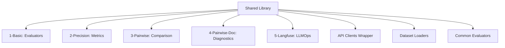

# Manual Técnico - Framework de Avaliação

Este documento descreve a arquitetura técnica e os padrões de implementação do framework de avaliação de prompts. O sistema é projetado de forma modular, com uma biblioteca compartilhada (`shared`) fornecendo as primitivas para diferentes estratégias de avaliação.

## Arquitetura Geral

O módulo `7-evaluation` opera como um monorrepo de exemplos de avaliação, onde cada subdiretório (1 a 5) representa uma estratégia distinta, mas todos consomem utilitários comuns.



## Componentes Compartilhados (`shared/`)

A biblioteca `shared` é o núcleo técnico que garante consistência entre os experimentos.

- **`clients.py`**: Abstração agnóstica de provedor (OpenAI/Google). Implementa lógica de fallback e normalização de respostas.
- **`datasets.py`**: Utilitários para carregar datasets de arquivos JSONL ou do LangSmith, normalizando entradas e saídas esperadas (ground truth).
- **`evaluators.py`**: Implementação reutilizável de evaluators comuns (JSON valid, Schema compliance) e parsers robustos para extração de scores de respostas de LLMs.

[Ver Guia Técnico da Shared Library](./shared/instructions.md)

## Módulos de Avaliação

Cada módulo possui seu próprio guia técnico detalhando a implementação específica:

### 1. Evaluators Básicos
Implementação de validadores determinísticos e LLM-as-Judge para critérios simples.
- **Foco Técnico**: Parsers, RegEx, Schema Validation.
- [Ver Guia Técnico](./1-basic/instructions.md)

### 2. Precision & Recall
Implementação de métricas de classificação sobre saídas não estruturadas de LLMs.
- **Foco Técnico**: Comparação com Ground Truth, Matriz de Confusão, F1 Score.
- [Ver Guia Técnico](./2-precision/instructions.md)

### 3. Comparação Pairwise
Workflow de AB Testing automatizado com LangSmith.
- **Foco Técnico**: Datasets KV, Custom Evaluators no LangSmith, Prompt Versioning.
- [Ver Guia Técnico](./3-pairwise/instructions.md)

### 4. Diagnóstico Detalhado (Pairwise Doc)
Extensão do pairwise com métricas granulares para explicabilidade.
- **Foco Técnico**: Multi-dimensional evaluation, Structured Output Parsing.
- [Ver Guia Técnico](./4-pairwise-doc/instructions.md)

### 5. Integração Langfuse
Adaptação do pipeline para stack open-source.
- **Foco Técnico**: SDK do Langfuse, Tracing, Scores manuais via API.
- [Ver Guia Técnico](./5-langfuse/instructions.md)

## Configuração do Ambiente

O ambiente é unificado para o módulo 7.

1. **Virtualenv**: Deve ser criado na raiz de `7-evaluation`.
2. **Dependências**: `pip install -r requirements.txt` instala todo o superset necessário (LangChain, LangSmith, Langfuse, OpenAI, Google GenAI).
3. **Variáveis**: O `.env` na raiz de `7-evaluation` serve a todos os submódulos.

## Testes

O módulo possui testes unitários para garantir a estabilidade da biblioteca `shared`.

```bash
# Executar testes
python -m unittest discover tests
```
